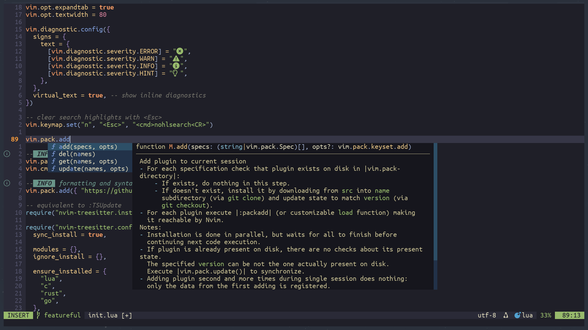
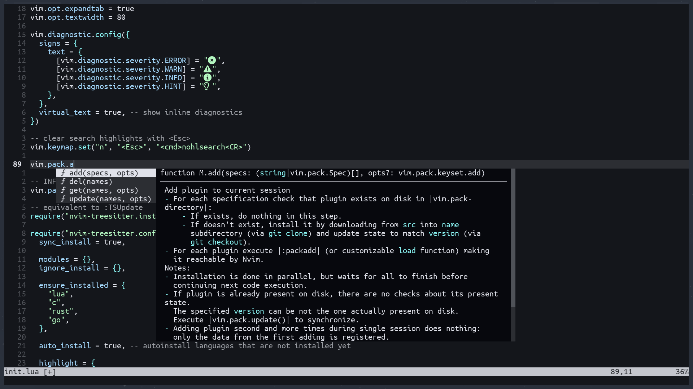
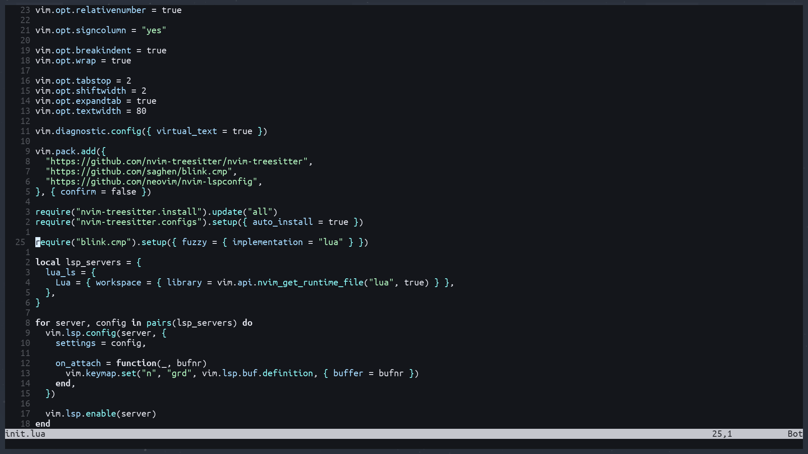

# Introduction
`minimal.nvim` comes in three flavors: `featureful`, `light` and `minimal`. 

- `featureful`: sane default options, highlighting, lsp diagnostics, completions, fuzzy finding and some quality-of-life/appearance plugins. heavily documented.
- `light`: sane default options, highlighting, lsp diagnostics, completions and fuzzy finding. heavily documented
- `minimal`: the absolute bare minimal for sane default options, highlighting, lsp diagnostics and completions. no comments in code

if you want the absolte minimal code necessary for having just higlighting + 
lsp diagnostics + completion. check out the [minimal](https://github.com/Hashino/minimal.nvim/tree/minimal/init.lua) branch

## Screenshots

featureful:


light:


minimal:


# Installation
Requires neovim version `0.12` or greater

## Dependencies
- `git` - for vim builtin package manager. (see `:h vim.pack`)
- `unzip` - for [mason](https://github.com/mason-org/mason.nvim), specifically for `clangd`, which the config installs by default
- `ripgrep` - for fuzzy finding 
- clipboard tool: xclip/xsel/win32yank - for clipboard sharing between OS and neovim (see `h: clipboard-tool`)
- a [nerd font](https://www.nerdfonts.com/) (ensure the terminal running neovim is using it)

> [!NOTE]
> for the minimal version, only `git` is required

---

to install run:

<details>
<summary> Linux/MacOS/WSL </summary>

---

<details><summary> featureful version </summary>

```
mkdir -p "${XDG_CONFIG_HOME:-$HOME/.config}"/nvim && wget https://raw.githubusercontent.com/Hashino/minimal.nvim/refs/heads/featureful/init.lua -O "${XDG_CONFIG_HOME:-$HOME/.config}"/nvim/init.lua && nvim -c ':e $MYVIMRC'
```
</details>

<details><summary> light version </summary>

```
mkdir -p "${XDG_CONFIG_HOME:-$HOME/.config}"/nvim && wget https://raw.githubusercontent.com/Hashino/minimal.nvim/refs/heads/light/init.lua -O "${XDG_CONFIG_HOME:-$HOME/.config}"/nvim/init.lua && nvim -c ':e $MYVIMRC'
```
</details>

<details><summary> minimal version </summary>

```
mkdir -p "${XDG_CONFIG_HOME:-$HOME/.config}"/nvim && wget https://raw.githubusercontent.com/Hashino/minimal.nvim/refs/heads/minimal/init.lua -O "${XDG_CONFIG_HOME:-$HOME/.config}"/nvim/init.lua && nvim -c ':e $MYVIMRC'
```
</details>

---

</details>

<details>
<summary> Windows (Powershell) </summary>

---

<details><summary> featureful version </summary>

```powershell
mkdir -Force $env:LOCALAPPDATA\nvim\ && curl https://raw.githubusercontent.com/Hashino/minimal.nvim/refs/heads/featureful/init.lua -o $env:LOCALAPPDATA\nvim\init.lua && nvim -c ':e $MYVIMRC'
```
</details>

<details><summary> light version </summary>

```powershell
mkdir -Force $env:LOCALAPPDATA\nvim\ && curl https://raw.githubusercontent.com/Hashino/minimal.nvim/refs/heads/light/init.lua -o $env:LOCALAPPDATA\nvim\init.lua && nvim -c ':e $MYVIMRC'
```
</details>

<details><summary> minimal version </summary>

```powershell
mkdir -Force $env:LOCALAPPDATA\nvim\ && curl https://raw.githubusercontent.com/Hashino/minimal.nvim/refs/heads/minimal/init.lua -o $env:LOCALAPPDATA\nvim\init.lua && nvim -c ':e $MYVIMRC'
```
</details>

---

</details>

or download [init.lua](init.lua) via the browser from the respective branch to the neovim config directory:

### Location
Neovim's configurations are located under the following paths, depending on your OS:

| OS | PATH |
| :- | :--- |
| Linux, MacOS | `$XDG_CONFIG_HOME/nvim`, `~/.config/nvim` |
| Windows | `%localappdata%\nvim\` |
