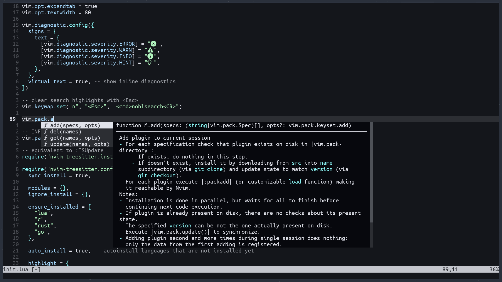

# Introduction
`minimal.nvim` comes in two flavors: `bare-minimum` and `featureful`. Whereas
the first contains only the bare minimum for having completions + lsp + fuzzy in
neovim, the featureful version also contains some quality of life plugins

## Screenshots

bare-minimum version:


featureful version:


# Installation
Requires neovim version `0.12` or greater

## Dependencies
- `git`
- `unzip`
- `ripgrep`
- clipboard tool: xclip/xsel/win32yank (see `h: clipboard-tool`)
- a [nerd font](https://www.nerdfonts.com/) (ensure the terminal running neovim is using it)

---

to install run:

for `bare-minimum`
```bash
mkdir -p "${XDG_CONFIG_HOME:-$HOME/.config}"/nvim && wget https://raw.githubusercontent.com/Hashino/minimal.nvim/refs/heads/bare-minimum/init.lua -O "${XDG_CONFIG_HOME:-$HOME/.config}"/nvim/init.lua && nvim
```
for `featureful`
```bash
mkdir -p "${XDG_CONFIG_HOME:-$HOME/.config}"/nvim && wget https://raw.githubusercontent.com/Hashino/minimal.nvim/refs/heads/main/init.lua -O "${XDG_CONFIG_HOME:-$HOME/.config}"/nvim/init.lua && nvim
```
or download [init.lua](init.lua) via the browser to the neovim config directory:

### Location
Neovim's configurations are located under the following paths, depending on your OS:

| OS | PATH |
| :- | :--- |
| Linux, MacOS | `$XDG_CONFIG_HOME/nvim`, `~/.config/nvim` |
| Windows | `%localappdata%\nvim\` |
